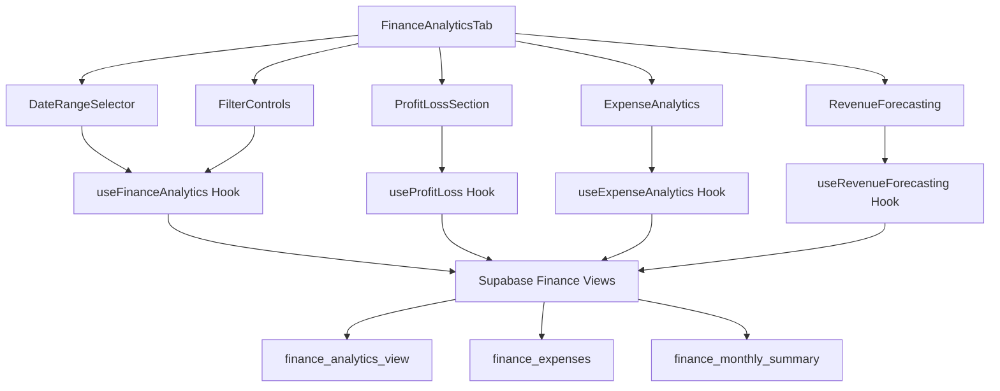

# Design Document

## Overview

The financial dashboard enhancement will transform the existing FinanceAnalyticsTab component into a comprehensive financial management system. The design leverages the existing finance analytics infrastructure while adding new capabilities for expense tracking, profit & loss analysis, interactive filtering, and advanced visualizations.

## Architecture

### Component Structure

```
FinanceAnalyticsTab (Enhanced)
├── DateRangeSelector
├── FilterControls
├── OverviewMetrics
├── ProfitLossSection
│   ├── PLSummaryCards
│   ├── PLChart
│   └── PLExportButton
├── ExpenseAnalytics
│   ├── ExpenseCategoryBreakdown
│   ├── ExpenseByProperty
│   └── ExpenseTrendChart
├── RevenueForecasting
│   ├── ForecastChart
│   ├── GrowthMetrics
│   └── RevenueSourceBreakdown
└── InteractiveCharts
    ├── RevenueChart
    ├── ExpenseChart
    └── ProfitMarginChart
```

### Data Flow Architecture



## Components and Interfaces

### Enhanced FinanceAnalyticsTab Component

```typescript
interface FinanceAnalyticsTabProps {
  dateRanges?: DateRange[];
  defaultView?: 'overview' | 'profit-loss' | 'expenses' | 'forecasting';
  enableExport?: boolean;
  enableFiltering?: boolean;
}

interface DateRange {
  year: number;
  month: number;
  label: string;
}

interface FilterState {
  dateRange: 'current-month' | 'last-month' | 'quarter' | 'year' | 'custom';
  customStartDate?: Date;
  customEndDate?: Date;
  properties?: string[];
  categories?: string[];
  clients?: string[];
}
```

### Profit & Loss Components

```typescript
interface ProfitLossData {
  revenue: number;
  expenses: number;
  grossProfit: number;
  netProfit: number;
  profitMargin: number;
  expensesByCategory: ExpenseCategory[];
  monthlyTrend: MonthlyPLData[];
  yearOverYearComparison: YearComparison[];
}

interface ExpenseCategory {
  category: string;
  amount: number;
  percentage: number;
  monthlyTrend: number;
  budgetVariance?: number;
}

interface MonthlyPLData {
  month: string;
  revenue: number;
  expenses: number;
  profit: number;
  profitMargin: number;
}
```

### Expense Analytics Components

```typescript
interface ExpenseAnalyticsData {
  totalExpenses: number;
  expensesByCategory: ExpenseCategory[];
  expensesByProperty: PropertyExpense[];
  monthlyExpenseTrend: MonthlyExpense[];
  topExpenseCategories: ExpenseCategory[];
  budgetComparison: BudgetComparison[];
}

interface PropertyExpense {
  propertyId: string;
  propertyName: string;
  totalExpenses: number;
  categories: ExpenseCategory[];
  monthlyTrend: MonthlyExpense[];
}

interface BudgetComparison {
  category: string;
  budgeted: number;
  actual: number;
  variance: number;
  variancePercentage: number;
}
```

### Revenue Forecasting Components

```typescript
interface RevenueForecastData {
  currentRevenue: number;
  projectedRevenue: number;
  growthRate: number;
  confidenceLevel: number;
  forecastPeriods: ForecastPeriod[];
  revenueBySource: RevenueSource[];
  seasonalTrends: SeasonalData[];
}

interface ForecastPeriod {
  period: string;
  projected: number;
  confidence: number;
  factors: string[];
}

interface RevenueSource {
  source: string;
  amount: number;
  percentage: number;
  growth: number;
}
```

## Data Models

### Database Schema Extensions

```sql
-- Enhanced expense tracking
CREATE TABLE IF NOT EXISTS finance_expenses (
  id UUID PRIMARY KEY DEFAULT gen_random_uuid(),
  company VARCHAR(255),
  date DATE NOT NULL,
  type VARCHAR(100) DEFAULT 'Expense',
  payee VARCHAR(255),
  category VARCHAR(100),
  subcategory VARCHAR(100),
  amount DECIMAL(10,2) NOT NULL,
  currency VARCHAR(3) DEFAULT 'USD',
  property_id UUID REFERENCES properties(id),
  department VARCHAR(100),
  description TEXT,
  receipt_url VARCHAR(500),
  approval_status VARCHAR(50) DEFAULT 'pending',
  created_at TIMESTAMP WITH TIME ZONE DEFAULT NOW(),
  updated_at TIMESTAMP WITH TIME ZONE DEFAULT NOW()
);

-- Profit & Loss materialized view
CREATE MATERIALIZED VIEW finance_profit_loss_summary AS
SELECT 
  DATE_TRUNC('month', COALESCE(fi.date_paid, fi.date_issued)) as period,
  SUM(CASE WHEN fi.invoice_status = 'paid' THEN fi.line_total ELSE 0 END) as revenue,
  COALESCE(SUM(fe.amount), 0) as expenses,
  SUM(CASE WHEN fi.invoice_status = 'paid' THEN fi.line_total ELSE 0 END) - COALESCE(SUM(fe.amount), 0) as net_profit
FROM finance_invoices fi
LEFT JOIN finance_expenses fe ON DATE_TRUNC('month', fe.date) = DATE_TRUNC('month', COALESCE(fi.date_paid, fi.date_issued))
GROUP BY DATE_TRUNC('month', COALESCE(fi.date_paid, fi.date_issued))
ORDER BY period DESC;

-- Expense analytics view
CREATE VIEW finance_expense_analytics AS
SELECT 
  fe.*,
  p.name as property_name,
  p.address as property_address
FROM finance_expenses fe
LEFT JOIN properties p ON fe.property_id = p.id;
```

### TypeScript Interfaces

```typescript
interface FinanceExpense {
  id: string;
  company: string;
  date: string;
  type: string;
  payee: string;
  category: string;
  subcategory?: string;
  amount: number;
  currency: string;
  propertyId?: string;
  propertyName?: string;
  department?: string;
  description?: string;
  receiptUrl?: string;
  approvalStatus: 'pending' | 'approved' | 'rejected';
  createdAt: string;
  updatedAt: string;
}

interface ProfitLossSummary {
  period: string;
  revenue: number;
  expenses: number;
  netProfit: number;
  profitMargin: number;
}
```

## Error Handling

### Error Boundaries and Fallbacks

```typescript
interface ErrorBoundaryState {
  hasError: boolean;
  error?: Error;
  errorInfo?: ErrorInfo;
}

// Component-level error handling
const FinanceErrorBoundary: React.FC<{children: React.ReactNode}> = ({ children }) => {
  // Error boundary implementation with fallback UI
};

// Hook-level error handling
const useFinanceAnalyticsWithFallback = (dateRanges?: DateRange[]) => {
  const { data, error, isLoading } = useFinanceAnalytics(dateRanges);
  
  if (error) {
    console.error('Finance analytics error:', error);
    return {
      data: getDefaultFinanceMetrics(),
      error,
      isLoading: false
    };
  }
  
  return { data, error, isLoading };
};
```

### Data Validation

```typescript
const validateFinanceData = (data: any): FinanceMetrics => {
  return {
    totalRevenue: Number(data?.totalRevenue) || 0,
    totalInvoices: Number(data?.totalInvoices) || 0,
    // ... other validations with fallbacks
  };
};
```

## Testing Strategy

### Unit Testing

```typescript
// Component testing with React Testing Library
describe('FinanceAnalyticsTab', () => {
  it('renders overview metrics correctly', () => {
    render(<FinanceAnalyticsTab />);
    expect(screen.getByText('Total Revenue')).toBeInTheDocument();
  });

  it('handles date range filtering', () => {
    const { rerender } = render(<FinanceAnalyticsTab />);
    // Test date range changes
  });

  it('displays error states gracefully', () => {
    // Mock error state and test fallback UI
  });
});

// Hook testing
describe('useFinanceAnalytics', () => {
  it('fetches and processes data correctly', async () => {
    const { result } = renderHook(() => useFinanceAnalytics());
    await waitFor(() => expect(result.current.isLoading).toBe(false));
    expect(result.current.data).toBeDefined();
  });
});
```

### Integration Testing

```typescript
// Test data flow between components
describe('Finance Dashboard Integration', () => {
  it('updates all components when date range changes', () => {
    // Test that date range changes propagate correctly
  });

  it('maintains filter state across tab switches', () => {
    // Test state persistence
  });
});
```

### Performance Testing

```typescript
// Test large dataset handling
describe('Performance Tests', () => {
  it('handles 10,000+ invoice records efficiently', () => {
    // Performance benchmarks
  });

  it('renders charts with large datasets under 2 seconds', () => {
    // Chart rendering performance
  });
});
```

## Performance Optimizations

### Data Fetching Optimizations

1. **Materialized Views**: Use pre-computed views for complex aggregations
2. **Pagination**: Implement cursor-based pagination for large datasets
3. **Caching**: Implement React Query caching with appropriate stale times
4. **Lazy Loading**: Load chart data only when tabs are active

### Rendering Optimizations

1. **React.memo**: Memoize expensive components
2. **useMemo/useCallback**: Optimize expensive calculations and callbacks
3. **Virtual Scrolling**: For large data tables
4. **Chart Optimization**: Use canvas-based charts for large datasets

### Code Splitting

```typescript
// Lazy load chart components
const RevenueChart = lazy(() => import('./charts/RevenueChart'));
const ExpenseChart = lazy(() => import('./charts/ExpenseChart'));
const ProfitLossChart = lazy(() => import('./charts/ProfitLossChart'));

// Lazy load heavy analytics components
const ExpenseAnalytics = lazy(() => import('./ExpenseAnalytics'));
const RevenueForecasting = lazy(() => import('./RevenueForecasting'));
```

## Security Considerations

### Data Access Control

1. **Row Level Security (RLS)**: Ensure users only see their organization's data
2. **API Rate Limiting**: Prevent abuse of analytics endpoints
3. **Input Validation**: Sanitize all user inputs for filters and date ranges
4. **Export Controls**: Limit export functionality based on user permissions

### Sensitive Data Handling

1. **Data Masking**: Mask sensitive financial data in non-production environments
2. **Audit Logging**: Log all financial data access and exports
3. **Encryption**: Ensure all financial data is encrypted at rest and in transit

## Accessibility

### WCAG 2.1 AA Compliance

1. **Keyboard Navigation**: Full keyboard accessibility for all interactive elements
2. **Screen Reader Support**: Proper ARIA labels and descriptions
3. **Color Contrast**: Ensure sufficient contrast ratios for all text and charts
4. **Focus Management**: Clear focus indicators and logical tab order

### Chart Accessibility

```typescript
// Accessible chart implementation
const AccessibleChart = ({ data, title, description }) => (
  <div role="img" aria-labelledby="chart-title" aria-describedby="chart-desc">
    <h3 id="chart-title">{title}</h3>
    <p id="chart-desc">{description}</p>
    <Chart data={data} />
    <table className="sr-only">
      {/* Data table for screen readers */}
    </table>
  </div>
);
```

## Mobile Responsiveness

### Responsive Design Strategy

1. **Mobile-First Approach**: Design for mobile screens first
2. **Progressive Enhancement**: Add desktop features progressively
3. **Touch-Friendly Interactions**: Ensure all interactive elements are touch-accessible
4. **Adaptive Layouts**: Use CSS Grid and Flexbox for flexible layouts

### Mobile-Specific Features

```typescript
// Mobile-optimized chart interactions
const useMobileChartInteractions = () => {
  const [isMobile, setIsMobile] = useState(false);
  
  useEffect(() => {
    const checkMobile = () => setIsMobile(window.innerWidth < 768);
    checkMobile();
    window.addEventListener('resize', checkMobile);
    return () => window.removeEventListener('resize', checkMobile);
  }, []);
  
  return {
    isMobile,
    chartConfig: {
      responsive: true,
      maintainAspectRatio: !isMobile,
      plugins: {
        legend: {
          position: isMobile ? 'bottom' : 'right'
        }
      }
    }
  };
};
```