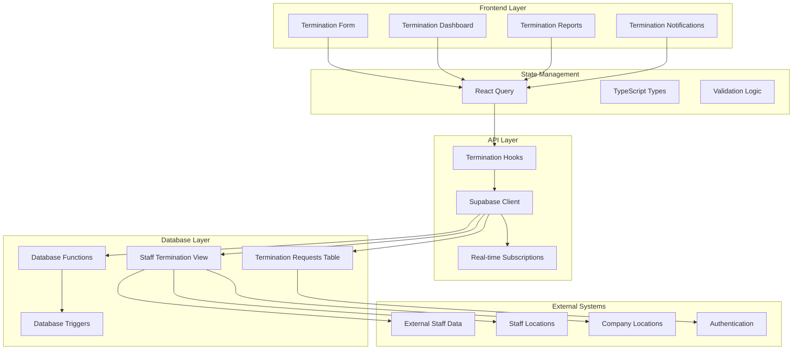
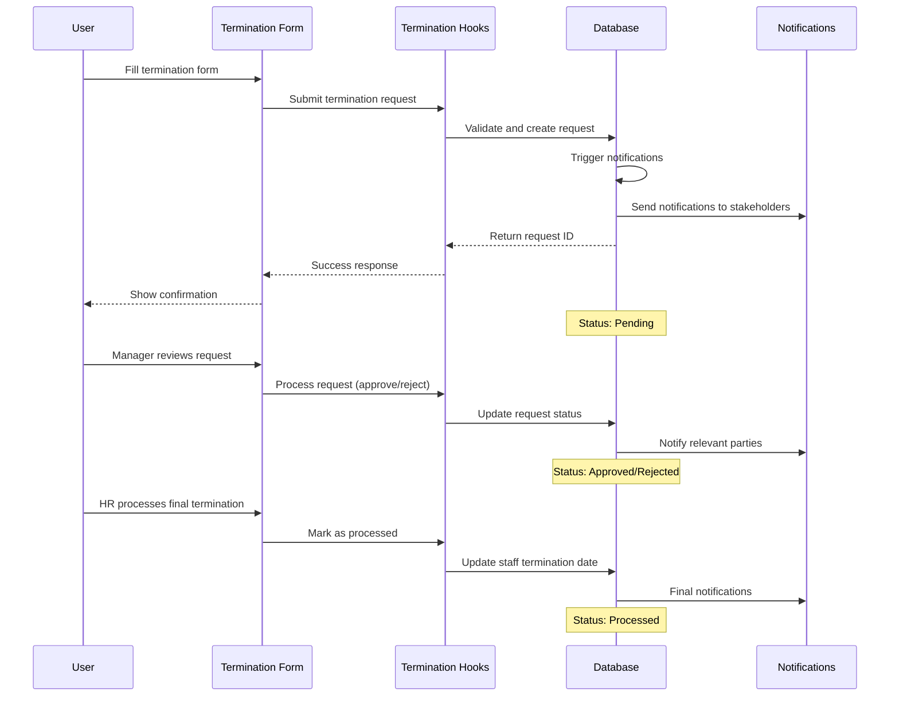

# Staff Termination Workflow Design

## Overview

The staff termination workflow system is designed as a comprehensive solution for managing employee terminations through a structured digital process. The system integrates with existing staff data, provides role-based access controls, and maintains complete audit trails for compliance purposes.

The architecture follows a modern React-based frontend with TypeScript, utilizing React Query for state management and Supabase for backend services. The system implements a multi-step workflow with proper validation, notifications, and reporting capabilities.

## Architecture

### System Components



### Data Flow Architecture



## Components and Interfaces

### Core Components

#### 1. TerminationForm Component
- **Purpose**: Primary interface for creating and editing termination requests
- **Props Interface**:
  ```typescript
  interface TerminationFormProps {
    onSuccess?: (requestId: string) => void;
    onCancel?: () => void;
    preSelectedStaffId?: string;
    editMode?: boolean;
    existingRequest?: TerminationRequest;
  }
  ```
- **Key Features**:
  - Employee selection with auto-complete
  - Manager auto-population based on staff location
  - Date validation (last day worked ≤ effective date)
  - Separation type and reason selection
  - Direct deposit instruction handling
  - Form validation with error display

#### 2. TerminationDashboard Component
- **Purpose**: Overview and management interface for all termination requests
- **Features**:
  - Status-based filtering (pending, approved, rejected, processed)
  - Search by employee name, manager, or request ID
  - Bulk actions for approved requests
  - Export functionality for reporting

#### 3. TerminationRequestCard Component
- **Purpose**: Individual request display with action buttons
- **Features**:
  - Request summary information
  - Status indicators with color coding
  - Action buttons based on user role and request status
  - Quick approval/rejection for managers

#### 4. TerminationAnalytics Component
- **Purpose**: Reporting and analytics dashboard
- **Features**:
  - Termination trends over time
  - Separation type breakdown
  - Department-wise termination rates
  - Average processing time metrics

### Custom Hooks

#### 1. useStaffTerminationView
- **Purpose**: Fetch staff data with termination eligibility
- **Parameters**: Filtering options (company, location, active only)
- **Returns**: Staff list with manager information

#### 2. useSubmitTerminationRequest
- **Purpose**: Handle termination request submission
- **Features**: Form validation, optimistic updates, error handling

#### 3. useProcessTerminationRequest
- **Purpose**: Handle request approval/rejection/processing
- **Features**: Status updates, notification triggers, audit logging

#### 4. useTerminationAnalytics
- **Purpose**: Fetch termination statistics and trends
- **Returns**: Aggregated data for reporting dashboard

## Data Models

### Core Entities

#### TerminationRequest
```typescript
interface TerminationRequest {
  id: string;
  staff_id: string;
  manager_id: string | null;
  effective_termination_date: string;
  last_day_worked: string;
  separation_type: 'voluntary' | 'involuntary' | 'layoff' | 'retirement' | 'other';
  reason_for_leaving: string;
  eligible_for_rehire: boolean;
  direct_deposit_instruction: 'stop' | 'continue' | 'change';
  additional_notes: string | null;
  submitted_by: string;
  submitted_at: string;
  status: 'pending' | 'approved' | 'rejected' | 'processed';
  processed_by: string | null;
  processed_at: string | null;
  created_at: string;
  updated_at: string | null;
}
```

#### StaffTerminationView
```typescript
interface StaffTerminationView {
  staff_id: string;
  full_name: string;
  job_title: string | null;
  work_email: string | null;
  personal_email: string | null;
  company_code: string | null;
  location_name: string | null;
  manager_id: string | null;
  manager_full_name: string | null;
  manager_work_email: string | null;
  employment_status: 'active' | 'terminated' | 'leave' | 'suspended' | 'unknown';
  eligible_for_termination: boolean;
  hire_date: string | null;
  years_of_service: string | null;
}
```

### Database Schema

#### Tables
1. **termination_requests**: Core termination request data
2. **external_staff**: Employee master data (existing)
3. **staff_locations**: Location and manager relationships (existing)
4. **company_locations**: Company location details (existing)

#### Views
1. **staff_termination_view**: Comprehensive staff data with manager info
2. **termination_requests_detailed**: Requests with staff and manager details

#### Functions
1. **submit_termination_request()**: Validates and creates new requests
2. **process_termination_request()**: Handles status updates and staff record changes
3. **get_staff_for_termination()**: Filtered staff list for termination
4. **get_managers_for_location()**: Manager list by location

## Error Handling

### Validation Rules
1. **Required Fields**: Staff ID, effective date, last day worked, separation type, reason
2. **Date Logic**: Last day worked must be ≤ effective termination date
3. **Staff Eligibility**: Only active, non-terminated staff can be selected
4. **Manager Assignment**: Auto-populate when available, allow manual override

### Error Types
1. **Validation Errors**: Client-side form validation with field-specific messages
2. **Business Logic Errors**: Server-side validation (e.g., staff already terminated)
3. **Database Errors**: Connection issues, constraint violations
4. **Permission Errors**: Role-based access control violations

### Error Display
- Field-level validation errors with red highlighting
- Form-level error summary at top of form
- Toast notifications for submission success/failure
- Detailed error logging for debugging

## Testing Strategy

### Unit Tests
1. **Component Tests**: Form validation, user interactions, prop handling
2. **Hook Tests**: API calls, state management, error scenarios
3. **Utility Tests**: Date validation, form helpers, data transformations

### Integration Tests
1. **Form Submission Flow**: End-to-end request creation
2. **Approval Workflow**: Manager and HR processing flows
3. **Database Integration**: CRUD operations, constraint validation
4. **Real-time Updates**: Notification and status change propagation

### E2E Tests
1. **Complete Termination Workflow**: From request to processing
2. **Role-based Access**: Different user permissions and views
3. **Error Scenarios**: Network failures, validation errors
4. **Performance Tests**: Large dataset handling, concurrent users

### Test Data Management
- Mock staff data for consistent testing
- Test user accounts with different roles
- Automated test database setup and teardown
- Snapshot testing for UI components

## Security Considerations

### Authentication & Authorization
- Role-based access control (HR, Manager, Employee)
- Row-level security policies in database
- JWT token validation for API calls
- Session management and timeout handling

### Data Protection
- Sensitive data encryption at rest
- Secure transmission (HTTPS/TLS)
- Audit logging for all termination actions
- Data retention policies compliance

### Input Validation
- Client-side validation for user experience
- Server-side validation for security
- SQL injection prevention through parameterized queries
- XSS protection through input sanitization

## Performance Optimization

### Database Optimization
- Proper indexing on frequently queried columns
- View materialization for complex joins
- Query optimization for large datasets
- Connection pooling and caching strategies

### Frontend Optimization
- React Query caching for API responses
- Lazy loading for large component trees
- Debounced search inputs
- Optimistic updates for better UX

### Scalability Considerations
- Horizontal scaling capability
- Database partitioning for large datasets
- CDN integration for static assets
- Load balancing for high availability